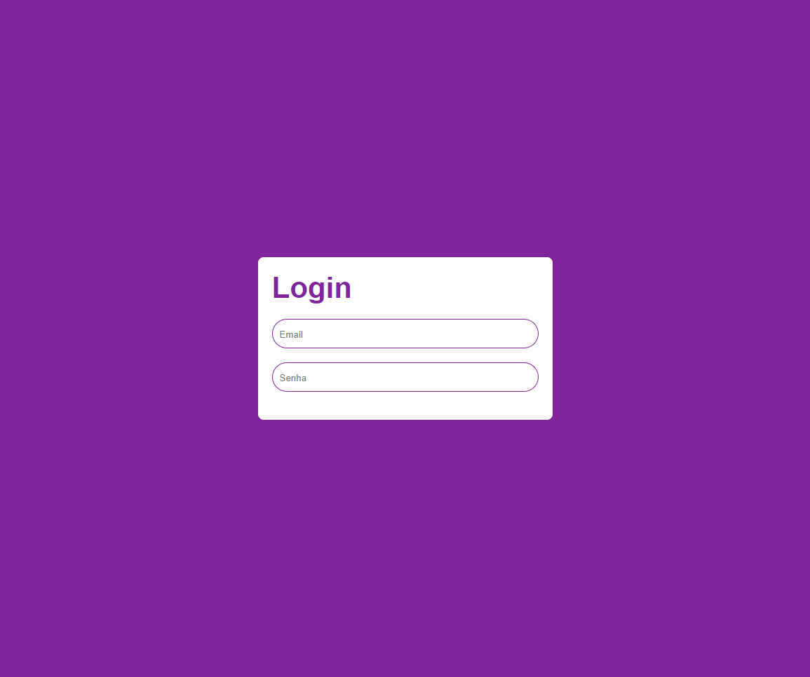

<h1 align="center">Tela de Login com Typescript e React Form Hoojs</h1>

O Projeto consiste na aplicação de tela de loguin utilizando typescript e form Hooks para criar a validação do email e da senha.

## Súmario

- [✨ Features](#features)
- [🏆 Sobre](#sobre)

<h2 id="features">✨ Features </h2>

- React
- HTML
- CSS
- Styled Components
- React Hooks Forms

<h2 id="sobre">🏆 Sobre</h2>

Como objetivo desse projeto construímos uma tela de login utilizando como base do projeto React e TypeScript, colocando em prática o conceito de trabalharmos com uma IDE inteligênte identificando os erros durante o processo de desenvolvimento, para a construção visual foi utilizado o Styled-Components. Optei por ocultar o Button equanto os dois Input não atenderem as demandas exigidas, para o email ele deve seguir o padrão comum, e para a senha exigida apenas um mínimo de 6 caracteres, para a detecção de erro foi optado por utilizar o padrão <strong>mode: "onBlur"</strong>, ou seja quando o usuário perder o foco do campo caso tenha algum erro ele será detectado.